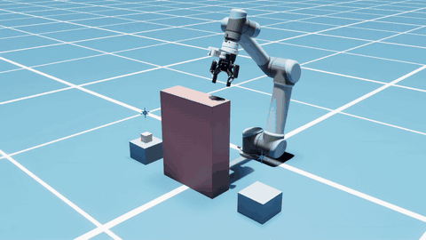
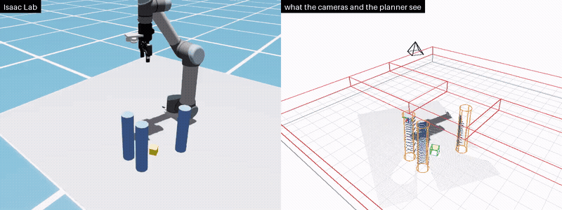

# UR5_curobo

**A UR5 on Isaac Lab, planned by cuRobo: camera-guided pick and place, and a
grasping task to train with RL.** The planner is never told where the obstacles
are — the cameras find them.

<p align="center">
  
  <br>
  <sub>pick_place, two round trips, 2× speed. Left: Isaac Lab. Right: what the
  cameras saw (points) and the map the planner avoids (magenta), from the same
  viewpoint. <a href="docs/media/pick_place.mp4">Real time (MP4)</a></sub>
</p>

<p align="center">
  
  <br>
  <sub>grasp, 2× speed: the first policy (<code>scripts/grasp/policies/first.pt</code>) on two crowded
  layouts it never trained on (evaluation bank rows 51 and 165), as the real arm
  would run it -- the wrist camera's scan, the map, perception's estimate (0.1 mm
  off, yellow against the truth in green), one attempt each.
  <a href="docs/media/grasp.mp4">Real time (MP4)</a></sub>
</p>

A UR5 (CB3) with a Robotiq FT 300, Wrist Camera, 2F-85 gripper and a RealSense
D435i, in two examples:

- **`pick_place`** shuttles a block between two pedestals. Between them stands a
  slab that exists **only in the simulator**: a wrist camera and a fixed
  overhead camera fuse depth into a live map with cuRobo 0.8's mapper, and the
  planner routes around whatever the map holds.
- **`grasp`** lifts a 45 mm cube from among 0–4 tall cylinders, with the wrist
  camera alone. A PPO policy picks where and at what angle to grip; cuRobo
  makes every motion. Everything the policy sees is something the real arm has.

Both are registered Isaac Lab tasks (`DirectRLEnv`), one gym id per task per
robot, and run one cell or many side by side.

| | result |
|---|---|
| pick_place, mapping off | closest approach to the slab **−16 to −26 mm** — straight through it |
| pick_place, mapping on | **−4 to +11 mm** — around it, once the map exists; block within 1–3 mm of its goal |
| grasp, first policy (500 PPO iterations, 5.4 h) | **91%** with the planner told the cylinders, **86%** with only the wrist camera's scan (oracle: 98% / 79%) |

---

## Requirements

- Ubuntu 22.04, conda
- An NVIDIA GPU and driver **≥ 580.65.06** (cuRobo 0.8's minimum). Developed on
  an RTX 5080 (16 GB) with 31 GB of RAM. No system CUDA toolkit is needed:
  cuRobo JIT-compiles its kernels at runtime.
- A desktop session for the viewer, or `--headless`

It runs as **two processes, by design**: Isaac Lab 2.3 runs on Isaac Sim 5.1 and
its Warp 1.8.2, cuRobo 0.8 needs Warp ≥ 1.13, and no version satisfies both.
cuRobo lives in `planner_server.py`, Isaac Lab in the client, and they talk over
a local socket. Nothing under `scripts/lab/` imports cuRobo.

## Install

**1. The environment** — Python 3.11, torch 2.7.0+cu128, Isaac Sim 5.1:

```bash
conda env create -f environment.yml
conda activate curobo_isaaclab
```

**2. cuRobo, from source, pinned.** Everything here was measured on commit
`8e734f3`, and `planner_server.py` refuses to start on any other:

```bash
git clone https://github.com/NVlabs/curobo ~/curobo
cd ~/curobo
git switch -c ur5-curobo-pin 8e734f3ced1df898990bcd92de40abce475907db
python -m pip install --upgrade-strategy only-if-needed -e ".[cu13]"
python -m pip install --no-deps "packaging==23.0"
cd -
```

- `[cu13]`, not `[cu12]`, whatever `nvidia-smi` says: Isaac Sim already
  brings the CUDA 13 pip packages, and `[cu12]` would downgrade them.
- The last line puts back the `packaging` version Isaac Sim pins, which the
  cuRobo install upgrades.
- Leave `websockets` at the version pip installs, even though Isaac Sim's
  metadata asks for 12.0; downgrading it breaks cuRobo's robot builder.
- Keep the pin on a branch, not a tag: cuRobo reads its version from
  `git describe`, and a non-version tag makes `import curobo` fail.

**3. Isaac Lab, from source, into the same environment.** Tested at commit
`b4c3210247` (`VERSION` 2.3.2, extension `isaaclab` 0.54.4):

```bash
git clone https://github.com/isaac-sim/IsaacLab ~/IsaacLab
cd ~/IsaacLab
git checkout b4c321024792976150ca55fddb26fa34480d974e
./isaaclab.sh --install rsl_rl
python -m pip install --no-deps "packaging==23.0"
cd -
```

`--install rsl_rl` adds the RL library training uses; the last line restores
`packaging` again. Then check that `python scripts/planner_server.py` still
starts.

**4. First launch.** Isaac Sim asks you to accept its EULA the first time it
starts (or set `OMNI_KIT_ACCEPT_EULA=YES` once you have read it). The first
launch on a machine builds shader and extension caches and can take well over
ten minutes; later ones take seconds.

**5. Check it works.** Each starts its own planner servers and ends with `PASS`
or `ALL PASSED`:

```bash
python tools/check_robot_cfg.py            # cuRobo only: FK, planner build, one plan (~1 min)
python tools/check_lab_modularity.py       # import rules, task registry, every scene builds
python tools/check_pick_place_lab.py       # pick_place, mapping off and on (~2 min)
python tools/check_grasp_lab.py            # the gripper lifts the cube, 20 times
python tools/check_grasp_env.py            # the grasp gym env with an oracle, and the rsl_rl wrapper
```

## pick_place: the demo

Two terminals, from the repository root. The server must be listening before
the client starts.

```bash
python scripts/planner_server.py
```

```bash
python scripts/pick_place/isaaclab_client.py --device cpu
```

The arm scans the cell, then carries the block back and forth. Drag the slab
(`/World/envs/env_0/drag_me`) in the viewport and the next plans go around its
new position. Closing the window does **not** stop the server; stop it with
Ctrl-C (`ss -ltnp | grep 5599` shows a stale one).

Several cells at once — one planner server per cell, since each holds the map
of what its own cameras saw:

```bash
python scripts/planner_servers.py --num 4
```

```bash
python scripts/pick_place/isaaclab_client.py --device cpu --num_envs 4 --camera-class tiled
```

| flag | side | |
|---|---|---|
| `--no-mapping` | both | plan against the static world only — the control |
| `--no-overhead` | client | wrist camera alone |
| `--headless` | client | no window; renders only if the cameras need it |
| `--static` | client | hold at HOME and just look through the cameras |
| `--scene NAME` | both | another example's scene (`scripts/NAME/scene.py`); must match |
| `--camera-class tiled` | client | one render product for every camera: about twice as fast with many cells |
| `--allow-curobo-drift` | server | start on a cuRobo other than the pinned commit |

**Use `--device cpu`.** With this robot's solver iterations GPU PhysX costs a
fixed ~20 ms a step however many cells; CPU PhysX is 0.8 ms for one and still
about 3× faster at 32.

## grasp: training and evaluation

One env step is **one grip attempt** in every environment: the policy gives
`[dx, dy, dz, yaw]` relative to the *perceived* cube centre; cuRobo plans above
it, descends straight, grips, lifts 75 mm. Success is a lift with the gripper
still holding. One attempt per episode, on layouts where exactly one of the two
face-square grips can be planned — choosing the right one is what there is to
learn (uniform random actions: 45%, an oracle that knows the answer: 98%).

- **The actor sees only what the real arm has** (29 numbers): the perceived
  cube pose, how much of it was seen, the perceived cylinders, the last attempt.
  The critic also gets the truth (45). Neither sees images:
  `scripts/grasp/perception.py` (numpy and scipy only, so it runs on the real
  arm unchanged) turns the scan's depth and RGB into the same numbers.
- **Training mode** renders nothing. The planner is told each environment's
  cylinders, and the perceived poses are the truth plus an error model
  (`TaskCfg` in `scripts/grasp/task.py`) deliberately wider than perception's
  measured error.
- **Evaluation mode** is the real arm's: every episode starts with a wrist
  camera scan, the map is built from it, the policy sees `perception.py`'s
  estimate, and straight moves are checked against the map.
- Layouts come from banks checked offline to have a grip that works
  (`scripts/grasp/layouts/`, built by `tools/grasp_layout_bank.py`).

Train (starts its own planner servers; 64 environments on one batch-planning
server is the fastest setting measured, ~13.5 attempts/s):

```bash
python scripts/grasp/isaaclab_train.py --smoke --batch      # 2 envs, 3 iterations: does it run
python scripts/grasp/isaaclab_train.py --num_envs 64 --num-servers 1 --batch --run-name first
tensorboard --logdir logs/rsl_rl/grasp
```

Checkpoints (every 25 iterations; the last is `model_499.pt`) and tensorboard
go to `logs/rsl_rl/grasp/<time>_<run-name>/`; `--resume` continues one. PPO is
in `scripts/grasp/lab_rl_cfg.py`, untuned. Besides the reward, tensorboard has
`episode/success`, `attempt/<outcome>` and `stuck_total` (returns home that had
to be teleports; should stay 0).

Evaluate a checkpoint, the oracle or random actions on the evaluation bank:

```bash
python scripts/grasp/isaaclab_eval.py --policy scripts/grasp/policies/first.pt --mode eval
python scripts/grasp/isaaclab_eval.py --policy scripts/grasp/policies/first.pt --mode train --num_envs 8
python scripts/grasp/isaaclab_eval.py --policy logs/rsl_rl/grasp/<run>/model_N.pt --num_envs 1 --episodes 20 --gui
```

`scripts/grasp/policies/first.pt` is the first run's last checkpoint (below),
kept in the repository so the numbers and the video can be reproduced without
training.

`--gui` opens the window to watch. While a training run holds the default
port, add `--port 5699` so the evaluation's servers can bind.

**The first run** (2026-09-24/25, 64 envs, 500 iterations, 5.4 h): training
success rose 54% → 89%, most of it in the first 200 iterations; what is left is
mostly choosing the wrong pair of faces. Its last checkpoint (`model_499.pt`,
shipped as `scripts/grasp/policies/first.pt`) on the evaluation bank, 64
episodes each:

| | training mode | evaluation mode |
|---|---|---|
| policy | **58/64 (91%)** | **55/64 (86%)** |
| failures | 5 no plan, 1 empty grip | 8 straight moves refused by the map, 1 no plan |
| cylinder contacts | 0 | 3 |
| oracle, for comparison | 98% | 79% |

In evaluation mode the policy beats the oracle, apparently by gripping further
from cylinders the map makes fatter than they are.

**Before the real arm:**

1. **Success is too lenient.** A diagonal grip holds the 45 mm cube in
   simulation but would likely slip in a real 2F-85; the policy may have learnt
   such grips. Require the grip to be near face-square, or a shake after the
   lift, and retrain.
2. **Contacts in evaluation mode** come from an incomplete map: tops of
   cylinders at the workspace's edge are in no scan view, and `MoveTo` does not
   confirm the arm arrived.
3. **Perception on hardware:** a yellow 45 mm cube (the colour thresholds in
   `PerceptionCfg` are the simulator's and need re-tuning under real light),
   hand-eye calibration, and a measurement of the real error to check it lies
   inside the training error model.
4. **A hardware cell:** something that offers `cell_api`'s primitives on the
   real UR5, 2F-85 and D435i.

`BatchMotionPlanner`, which `--batch` uses, is a private cuRobo module and does
not retry; a cuRobo upgrade may need changes there.

## Point cloud viewer

`--viz` serves a 3D view of one environment in the browser (viser), next to
the simulator or with `--headless`, and prints its URL (default
`http://localhost:8080`):

```bash
python scripts/pick_place/isaaclab_client.py --device cpu --viz
python scripts/grasp/isaaclab_eval.py --policy scripts/grasp/policies/first.pt --num_envs 1 --viz
python tools/view_captures.py /tmp/grasp_capture        # saved scans, no simulator
```

Four layers, each a checkbox:

| layer | shows |
|---|---|
| cameras | every view's depth as points (RGB-coloured, else by height) and its frustum; a scan's views overlap where the poses are right |
| map | the voxels the planner avoids, from the planner server (`voxels` op), in magenta |
| perception | grasp: the estimated cube and cylinders (yellow) against the truth (green, blue), and the volume perception looks in |
| reference | the scene: obstacles, keep-out volumes, simulator-only bodies where they stand, the payload, the targets |

It updates after every pick-and-place cycle, env step or scan, not
continuously; `--viz-env N` picks the environment, `--viz-stride` the
point density (every 4th pixel each way by default). `grasp_capture.py`
saves the scans `view_captures.py` reads; `tools/record_pick_place.py` and
`tools/record_grasp.py` record the videos above, both views side by side
(`record_grasp.py --dry-run` first, to find layouts the policy lifts). The viewer itself
(`scripts/cloud_viewer.py`) needs no simulator, so it takes a real camera's
views the same way.

## Use it from code

As any Isaac Lab task: start the app first, then make the environment from its
registered id.

```python
import sys; sys.path.insert(0, "scripts")
from isaaclab.app import AppLauncher
app = AppLauncher(headless=True, device="cpu").app       # before anything else from Isaac

import gymnasium as gym, torch
import lab                                               # registers the ids
from isaaclab_tasks.utils.parse_cfg import parse_env_cfg

cfg = parse_env_cfg("Isaac-PickPlace-Ur5Robotiq-v0", device="cpu", num_envs=1)
cfg.cell.mapping = False                                 # the server needs --no-mapping to match
env = gym.make("Isaac-PickPlace-Ur5Robotiq-v0", cfg=cfg)
obs, extras = env.reset(seed=0, options={"block_on": 0})
obs, reward, terminated, truncated, extras = env.step(torch.tensor([[x, y, z, yaw]]))
extras["leg"][0]                                         # what the leg did: plan, clearance, grip, ...
```

The primitives underneath:

```python
cell = env.unwrapped.cell.view(0)       # one environment as a cell_api.CellLike
cell.move_to(target); cell.move_tool_z(-0.125); cell.grip(close=True)
obs = cell.observe()
```

`cfg.cell` (`scripts/lab/cell_cfg.py`) holds every runtime setting: robot,
scene, mapping, cameras, markers, depth lag, planner mode.

## Layout

```
scripts/
  ── shared, whatever the example ──
  planner_server.py     cuRobo: planning + live mapping, on a local socket
  planner_servers.py    N of them on consecutive ports; launch() for other programs
  planner_client.py     its client; needs neither Isaac nor cuRobo
  cell_api.py           the cell contract: reset options, results, primitives, ops
  legs.py               one grip as ops: above, down, grip, up
  urdf_frames.py        frame arithmetic read off the URDF
  pointcloud.py         depth images to points
  cloud_viewer.py       the browser viewer (viser): cameras, map, perception, reference
  rig.py                robots (arm + gripper settings), timing, port, cuRobo pin
  scenes/               the scene contract (base.py) and registry

  ── the backend ──
  lab/                  Isaac Lab: robots, scene, cell (N envs), programs,
                        planner pool, USD edits, CellEnv, the task registry,
                        viz (the viewer on a live cell)

  ── examples, one folder each ──
  pick_place/           scene, task (simulator-free), lab_env (the task),
                        isaaclab_client + demo_loop (the demo)
  grasp/                scene, task, perception, viz (all simulator-free), lab_env,
                        lab_rl_cfg, lab_policy, isaaclab_train, isaaclab_eval,
                        layouts/ (the layout banks), policies/ (a trained checkpoint)
configs/                cuRobo robot config (generated)
assets/robot/           the robot description, one folder per device
tools/                  checks, builders, grasp data, videos (below)
```

`tools/`, by what each is for. The checks start their own planner servers and
end with `PASS` / `ALL PASSED`; everything else says in its docstring how to run it.

| for | tools |
|---|---|
| checking it works | `check_robot_cfg.py` (cuRobo only), `check_lab_modularity.py` (import rules, registry, every scene builds), `check_pick_place_lab.py`, `check_grasp_lab.py` (physics: the gripper lifts the cube), `check_grasp_env.py` (the gym env with the oracle), `check_grasp_perception.py` (perception against the truth, on saved scans) |
| rebuilding the robot | `build_ur5_robotiq_urdf.py` (the URDF from the upstream description), `build_ur5_robotiq_config.py` (cuRobo's config from the URDF) |
| rebuilding grasp's data | `grasp_layout_bank.py` (the layout banks; uses `grasp_reach.py`), `grasp_scan_poses.py` (HOME and the scan poses), `grasp_capture.py` (save scans with the truth) |
| looking and recording | `view_captures.py` (saved scans in the browser), `record_pick_place.py`, `record_grasp.py` (the videos above; both on `recording.py`) |

Dependencies point one way: an example → the backend → the shared modules.
Inside an example, files named `lab_*` / `isaaclab_*` are the Isaac Lab side
and everything else must be simulator-free, because the planner server or the
real arm may import it. `tools/check_lab_modularity.py` checks all of it.

Everything plugs into registries:

| to add | do this |
|---|---|
| a robot | an entry in `rig.ROBOTS` (URDF, cuRobo config, joints, gains, drive type, gripper); a gym id per task appears, `Isaac-{Task}-{Robot}-v0` |
| a gripper mechanism | a handler in `lab/usd_edits.LINKAGES`, named by the rig's `gripper.linkage` |
| a scene | an example folder `scripts/<name>/` with a `scene.py` defining a `SceneSpec` |
| a camera kind | a builder in `lab/scene_cfg.CAMERA_BUILDERS` |
| a task | the example's `lab_env.py` with a `CellEnvCfg` / `CellEnv` subclass, and a line in `lab/tasks/TASKS` |
| a planner transport | a `PlannerPool` subclass in `lab/planner_pool.py`, chosen by `CellCfg.planner_mode` |

## Limitations

- **The margin is thin.** Mapped routes skim the slab (−4 to +11 mm) rather
  than clear it comfortably. Fine for a simulation demo, not a safety margin
  for hardware.
- **Simulation only, so far.** pick_place's overhead camera exists only in the
  simulator and its task observes the block's true pose; grasp was built for
  the real arm, but see *Before the real arm* above.
- A planner server takes about 2 GB of RAM and 0.55 GB of GPU memory; with
  mapping on each cell needs its own, which limits this machine to about 8.

## More

- Why each setting is what it is — drive gains and types, mapper settings, the
  scenes' layouts, the upstream cuRobo bugs worked around, what Isaac Lab's
  importer does differently — is written next to the setting, with the
  measurement behind it: `scripts/rig.py`, `scripts/lab/robots.py`,
  `scripts/lab/cell_cfg.py`, `scripts/*/scene.py`, `scripts/grasp/task.py`,
  `scripts/planner_server.py`.
- The design documents and the Isaac Sim backend this grew from are in the git
  history (last at `37427b8` and `17eff58`).
- [assets/robot/ur5_robotiq/PROVENANCE.md](assets/robot/ur5_robotiq/PROVENANCE.md)
  — where the robot description comes from. It is vendored from
  [eugene900805/mir_ur5_humble](https://github.com/eugene900805/mir_ur5_humble)
  with the MiR100 chassis removed and nothing else changed.

## License

MIT — see [LICENSE](LICENSE). The vendored robot description keeps its own
licences, listed in PROVENANCE.md.
